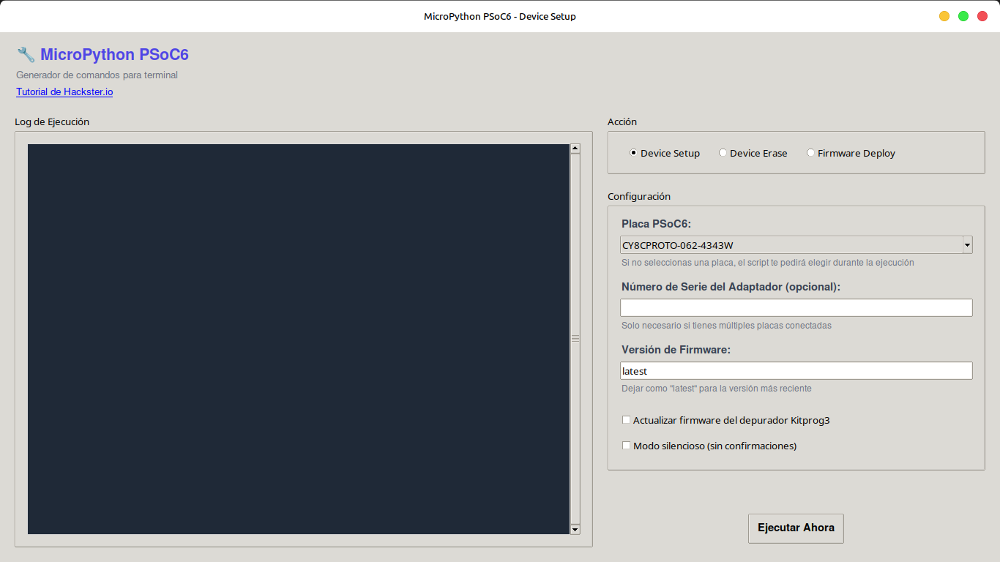

# MicroPython PSoC6 GUI and Flashing Tool

This project provides a set of tools to simplify the process of installing and managing MicroPython on Infineon PSoC6 microcontrollers. It consists of a command-line script (`mpy-psoc6.py`) for power users and a user-friendly graphical interface (`gui.py`) for easier operation.

Source code: [MicroPython on PSoC™](https://www.hackster.io/Infineon_Team/micropython-on-psoc-fcf1d0)

The tools automate the download of necessary dependencies like OpenOCD and fw-loader, as well as the MicroPython firmware itself, making the device setup process seamless.

## Features

-   **Graphical User Interface**: An intuitive GUI to select options and run commands without using the terminal.
-   **Command-Line Interface**: A powerful CLI for scripting and automation.
-   **Automated Tool Download**: Automatically downloads and configures `OpenOCD` and `fw-loader`.
-   **Firmware Management**:
    -   **Device Setup**: Downloads the latest or a specific version of MicroPython and flashes it to the board.
    -   **Device Erase**: Erases the external flash memory of the device.
    -   **Custom Firmware Deploy**: Flashes any user-provided `.hex` file.
-   **KitProg3 Firmware Update**: Option to update the onboard KitProg3 debugger firmware.

## Supported Boards

-   `CY8CPROTO-062-4343W`
-   `CY8CPROTO-063-BLE`
-   `CY8CKIT-062S2-AI`

## Prerequisites

-   Python 3.6+
-   The `requests` library. You can install it using pip:
    ```bash
    pip install requests
    ```
-   The `tkinter` library for the GUI, which is usually included with standard Python installations. If not, you can install it using your system's package manager (e.g., `sudo apt-get install python3-tk` on Debian/Ubuntu).

## Usage

### Graphical User Interface 

The GUI provides an easy way to perform all available actions.



1.  **Launch the GUI:**
    ```bash
    python3 gui.py
    ```
2.  **Select an Action**: Choose between "Device Setup", "Device Erase", or "Firmware Deploy".
3.  **Configure Options**: Select your board, specify a firmware version, or provide a path to a custom `.hex` file.
4.  **Execute**: Click "Ejecutar Ahora" (Execute Now). A new terminal window will open to run the command, which may ask for your `sudo` password if required for USB device access.

### Command-Line Interface

The CLI is ideal for automation or for users who prefer the terminal.

**General Syntax:**
```bash
python3 mpy-psoc6.py <command> [options]
```

#### **Commands**

**1. `device-setup`**

Installs MicroPython on your PSoC6 board. This is the most common command.

```bash
# Let the script prompt you to select a board
python3 mpy-psoc6.py device-setup

# Specify the board and version
python3 mpy-psoc6.py device-setup -b "CY8CPROTO-062-4343W" -v "latest"

# Update the KitProg3 debugger firmware during setup
python3 mpy-psoc6.py device-setup -b "CY8CPROTO-062-4343W" --kitprog-fw-update
```

**2. `device-erase`**

Erases the external memory of the board. This is useful for a clean start.

```bash
python3 mpy-psoc6.py device-erase -b "CY8CPROTO-062-4343W"
```
**Note:** After erasing, you must run `device-setup` again to install MicroPython.

**3. `firmware-deploy`**

Flashes a custom `.hex` file to the board.

```bash
python3 mpy-psoc6.py firmware-deploy -b "CY8CPROTO-062-4343W" -f "/path/to/your/firmware.hex"
```

For more details on all available options for a specific command, use the `--help` flag:
```bash
python3 mpy-psoc6.py <command> --help
